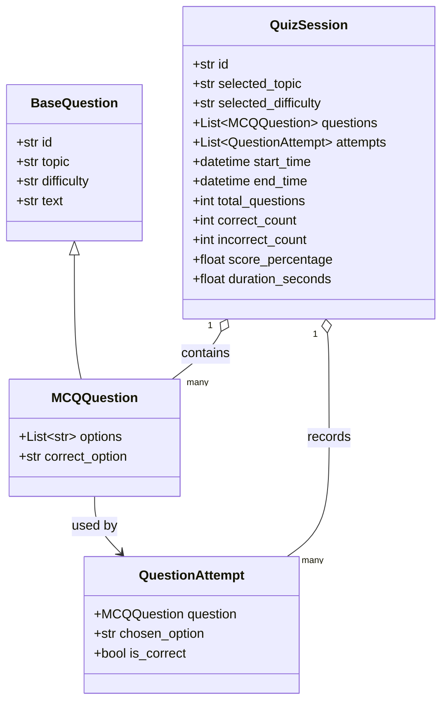
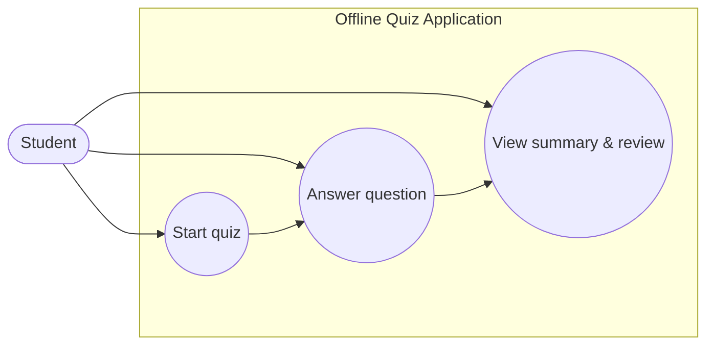
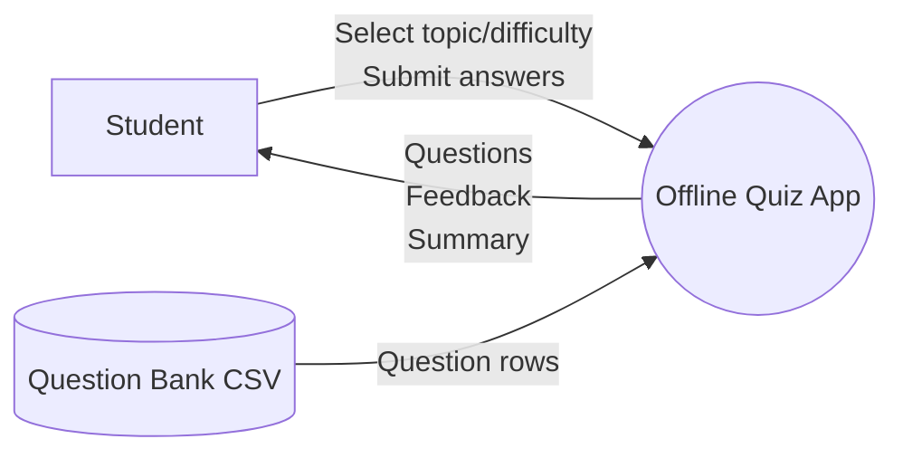
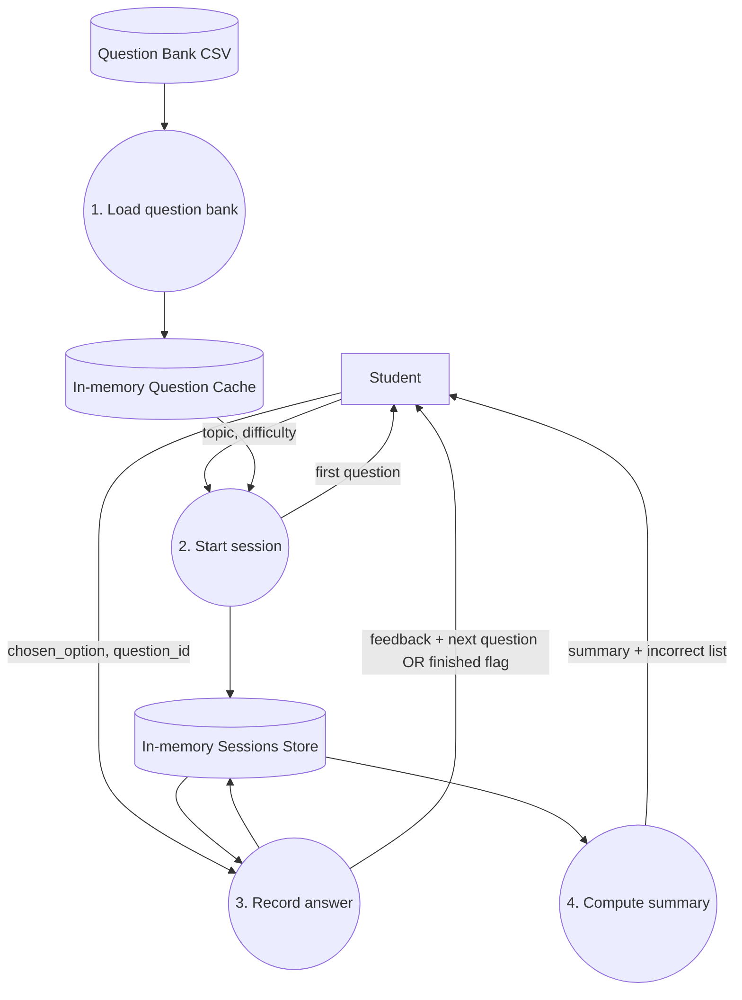

# Design (IB Computer Science IA)

## Purpose and scope

This document describes the design of the **Offline Quiz Application** from an IB Computer Science IA perspective. It focuses on:

- User interaction and navigation through the web interface.
- Core system behaviour and control flow.
- Data structures / data model derived from the CSV question bank.
- Use cases (UML use case diagram).
- Data flow diagrams (context + level 1).

The application is an **offline** FastAPI + Jinja2 web app. Questions are stored in a local CSV file and loaded into memory for the duration of the program.

## Design overview

### User interaction and navigation

**Primary user:** Student

**Navigation is single-page driven** (the app re-renders the same template `quiz.html` with different state):

1. **Open home page** (`GET /`)
   - The page displays:
     - Topic dropdown (derived from CSV)
     - Difficulty dropdown (derived from CSV)
     - “Start quiz” button

2. **Start a quiz** (`POST /api/quiz/start`)
   - Inputs:
     - `topic`
     - `difficulty`
   - Output:
     - A new quiz session is created (UUID session id).
     - The first question is displayed.
     - The page shows “Question X of 10”.

3. **Answer questions** (`POST /api/quiz/{session_id}/answer`)
   - Inputs:
     - `question_id` (hidden input)
     - `chosen_option` (radio selection)
   - Output:
     - Immediate feedback (“Correct!” / “Incorrect.”)
     - Next question is displayed until quiz is finished.

4. **View summary and review** (rendered when finished)
   - Summary includes:
     - Total attempted (number of questions answered in the session)
     - Correct / incorrect counts
     - Percentage score
     - Time spent
   - Review section lists incorrect questions with:
     - Question text
     - Student’s chosen option
     - Correct option

**Usability considerations (IA-oriented):**

- **Constraints / validation:** Required dropdown selections and required radio answer before submit.
- **Feedback:** Each answer returns correctness feedback immediately.
- **Consistency:** Same layout used for selection, quiz, and summary.
- **Offline-first:** No external API calls; all data read from local disk.

### High-level component design

- **Presentation layer (Browser + Jinja2 templates)**
  - Renders forms and displays quiz state.
- **API / controller layer (FastAPI routes)**
  - Validates user inputs and coordinates rendering.
- **Service layer (`quiz_service.py`)**
  - Loads CSV, manages quiz sessions, checks answers, computes summaries.
- **Model layer (`question.py`)**
  - Dataclasses representing questions, attempts, and sessions.
- **Data source (CSV)**
  - Local question bank used to create `MCQQuestion` instances.

## System flowchart

The diagram below shows the main logic from the user’s perspective.

```mermaid
flowchart TD
    A[Start: Student opens app] --> B[GET /]
    B --> C{CSV load ok?}
    C -- No --> C1[Show load error on page]
    C -- Yes --> D[Display topic + difficulty selectors]
    D --> E[Student selects topic + difficulty]
    E --> F[POST /api/quiz/start]
    F --> G[Create QuizSession + choose up to 10 questions]
    G --> H[Render Question 1]

    H --> I{Student submits an answer}
    I --> J[POST /api/quiz/{session_id}/answer]
    J --> K[Record QuestionAttempt]
    K --> L{More questions?}
    L -- Yes --> M[Render next question + feedback]
    M --> I
    L -- No --> N[Set end_time + compute summary]
    N --> O[Render summary + incorrect review]
    O --> P[End]
```

## Data design (CSV schema and in-memory model)

### CSV question bank (persistent data)

**File:** `src/data/question-bank.csv`

The file contains one row per question. The current dataset uses this schema ("schema_v2" in `quiz_service.load_question_bank()`):

- `topic` (string)
- `question` (string)
- `option1` (string)
- `option2` (string)
- `option3` (string)
- `option4` (string)
- `answer` (string, must match one of the 4 options)
- `difficulty` (string: easy | medium | hard)

Additional columns exist in the CSV (e.g., `asked_in_this_session`, `got_right`, `tag`) but the current implementation does **not** use them.

### In-memory data structures (program data)

The program converts each CSV row into an `MCQQuestion` dataclass and stores:

- A cached list of questions: `_QUESTIONS_CACHE: List[MCQQuestion]`
- A session store: `_SESSIONS: dict[str, QuizSession]` keyed by session UUID

**Rationale:**

- Caching avoids re-reading the CSV on every request.
- The in-memory session dictionary is enough for an offline IA-sized project and avoids database complexity.

### Data model (classes)



### Key derived collections

During execution the service derives:

- **Topics set:** `sorted({q.topic for q in questions})`
- **Difficulties set:** `sorted({q.difficulty for q in questions})`
- **Filtered question list:** questions matching selected topic + difficulty
- **Progress index:** `len(session.attempts)` to select the next question

## Use case model

### Use cases (text)

- **UC1: Start quiz**
  - Actor: Student
  - Preconditions: CSV loads successfully
  - Main success scenario:
    - Student selects `topic` and `difficulty`
    - System creates a new `QuizSession`
    - System displays first question

- **UC2: Answer question**
  - Actor: Student
  - Preconditions: Quiz session exists
  - Main success scenario:
    - Student selects an option and submits
    - System records attempt and indicates correct/incorrect
    - System shows next question OR summary if finished

- **UC3: View summary and review incorrect answers**
  - Actor: Student
  - Preconditions: Quiz finished
  - Main success scenario:
    - System computes totals and duration
    - System displays summary and incorrect review list

### Use case diagram



## Data flow diagrams (DFD)

### DFD Level 0 (Context diagram)



### DFD Level 1 (Main processes)



## Traceability to implementation

This design maps directly to the existing repository structure:

- **UI template:** `src/web/templates/quiz.html`
- **Routes/controllers:** `src/api/routes.py`
- **Business logic:** `src/services/quiz_service.py`
- **Data classes:** `src/models/question.py`
- **Data source:** `src/data/question-bank.csv`

Notes for marking criteria:

- The UI shows "Question X of Y" where `Y = len(session.questions)` (the selected set, up to 10).
- The summary field `total_questions` comes from `len(session.attempts)` (questions actually answered).

